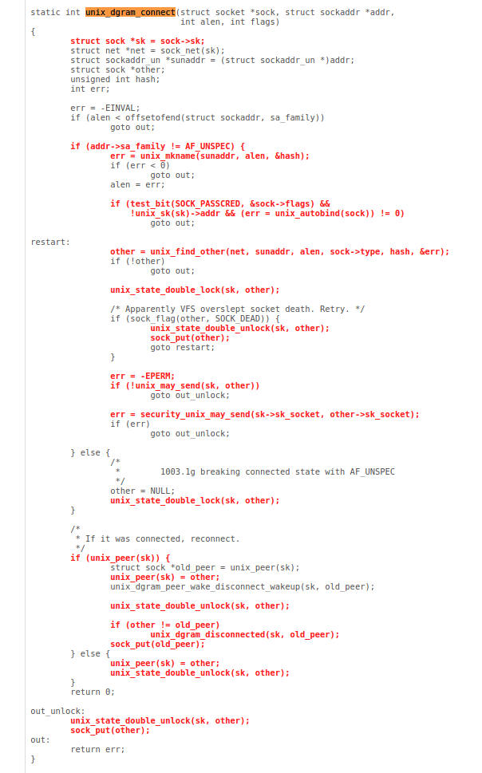
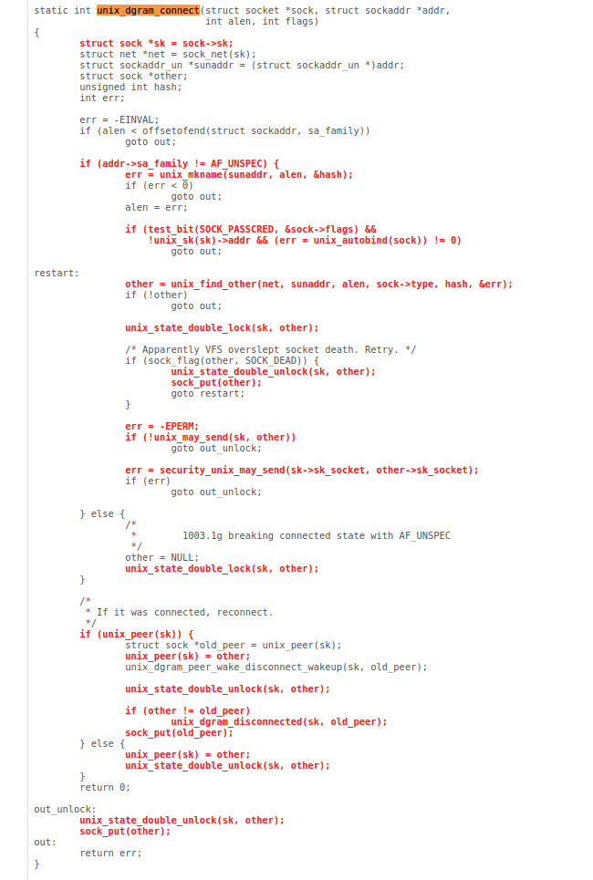
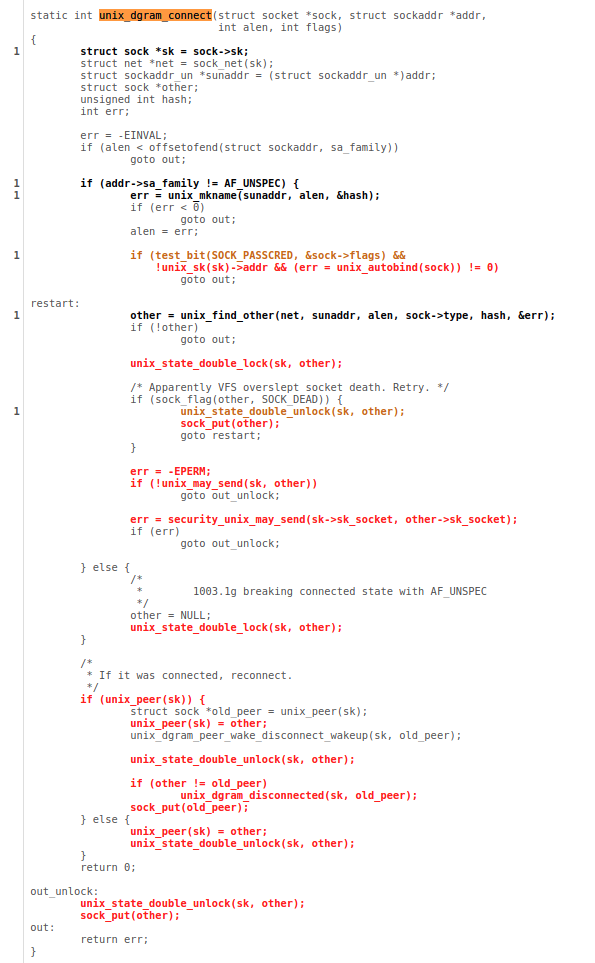

# Analysis of the coverage results in the __sys_connect call

## Minimal configuration

 displays the coverage results in the subtree of the __sys_connect function call. We first focus on the coveraga of the `__audit_sockaddr`(kernel/auditsc.c:2393) function. If we take a look at the [code](https://elixir.bootlin.com/linux/v5.9/source/net/socket.c#L1858) of the __sys_connect function:
```
int __sys_connect(int fd, struct sockaddr __user *uservaddr, int addrlen)
{
	int ret = -EBADF;
	struct fd f;

	f = fdget(fd);
	if (f.file) {
		struct sockaddr_storage address;

		ret = move_addr_to_kernel(uservaddr, addrlen, &address);
		if (!ret)
			ret = __sys_connect_file(f.file, &address, addrlen, 0);
		fdput(f);
	}

	return ret;
}
```
we can indentify multiple branch points. The first one is determined based on the output of the `fdget` function. Since `__fd_get` (in effect, inlined fd_get) is 100% covered we can, for now, ignore this as a possible cause of coverage drop. Next branch point is based on the result of the `move_addr_to_kernel` function. We can see the code in the following listing:
```
/*
 * Support routines.
 * Move socket addresses back and forth across the kernel/user
 * divide and look after the messy bits.
 */

/**
 *	move_addr_to_kernel	-	copy a socket address into kernel space
 *	@uaddr: Address in user space
 *	@kaddr: Address in kernel space
 *	@ulen: Length in user space
 *
 *	The address is copied into kernel space. If the provided address is
 *	too long an error code of -EINVAL is returned. If the copy gives
 *	invalid addresses -EFAULT is returned. On a success 0 is returned.
 */

int move_addr_to_kernel(void __user *uaddr, int ulen, struct sockaddr_storage *kaddr)
{
	if (ulen < 0 || ulen > sizeof(struct sockaddr_storage))
		return -EINVAL;
	if (ulen == 0)
		return 0;
	if (copy_from_user(kaddr, uaddr, ulen))
		return -EFAULT;
	return audit_sockaddr(ulen, kaddr);
}
```
Looking at the code of `move_addr_to_kernel` function we can conclude that this function returns success results (return value 0). This happens in the two cases:
1. ulen value is equal 0
2. audit_sockaddr(ulen, kaddr) returns 0

Function `audit_sockaddr` has two possible implementations based on the value of configuration parameter CONFIG_AUDITSYSCALL. Since this option is enabled in our Linux config file the version compiled into the executable is as follows:
```
static inline int audit_sockaddr(int len, void *addr)
{
	if (unlikely(!audit_dummy_context()))
		return __audit_sockaddr(len, addr);
	return 0;
}
```
We can see that the call to __audit_sockaddr is in a branch marked as `unlikely` by the developer. This means that the chances that the call will occur are really low (usually confirmed by careful benchmarking). 

Auditing is explained in more details here: https://www.halolinux.us/kernel-architecture/audit-context-allocation.html

## _fdget_light
```
/*
 * Lightweight file lookup - no refcnt increment if fd table isn't shared.
 *
 * You can use this instead of fget if you satisfy all of the following
 * conditions:
 * 1) You must call fput_light before exiting the syscall and returning control
 *    to userspace (i.e. you cannot remember the returned struct file * after
 *    returning to userspace).
 * 2) You must not call filp_close on the returned struct file * in between
 *    calls to fget_light and fput_light.
 * 3) You must not clone the current task in between the calls to fget_light
 *    and fput_light.
 *
 * The fput_needed flag returned by fget_light should be passed to the
 * corresponding fput_light.
 */
static unsigned long __fget_light(unsigned int fd, fmode_t mask)
{
	struct files_struct *files = current->files;
	struct file *file;

	if (atomic_read(&files->count) == 1) {
		file = __fcheck_files(files, fd);
		if (!file || unlikely(file->f_mode & mask))
			return 0;
		return (unsigned long)file;
	} else {
		file = __fget(fd, mask, 1);
		if (!file)
			return 0;
		return FDPUT_FPUT | (unsigned long)file;
	}
}
```

This function has 50% coverage. We can see from the code that the branching point does not depend on the input paramaters but the state of the current task. Therefore, manipulating the system calls with various input argument does not have an effect on the coverage of this function.

## unix_dgram_connect
The call to socket function
```
socket$unix(0x11, 0x2, 0x0)
```
does not affect the  of `unix_dgram_connect` function.

Coverage of the `unix_dgram_connect` with the arguments:
```
r0 = socket$unix(0x1, 0x1, 0x0)
connect$unix(r0, &(0x7f0000000140)=@file={0x1, './file0\x00'}, 0x6e)
```
is visible in the . We can see that this call does not cover the function at all. Argument indicating call [family](https://elixir.bootlin.com/linux/v5.9/source/arch/mips/include/asm/socket.h#L42) does not affect the coverage. Additional `connect` call did not affect the coverage.
 The same happens for the call in :
```
r0 = socket$unix(0x1, 0x5, 0x0)
connect$unix(r0, &(0x7f00000000c0)=@file={0x1, './file0\x00'}, 0x6e)
```
where only [type](https://elixir.bootlin.com/linux/v5.9/source/arch/mips/include/asm/socket.h#L42) of the socket changes.

The next example of system call finally increases the [coverage](img/unix_dgram_connect_535.png) of the selected function:
```
r0 = socket$unix(0x1, 0x2, 0x0)
connect$unix(r0, &(0x7f0000000040)=@abs, 0x6e)
```
Also:
```
r0 = socket$unix(0x1, 0x2, 0x0)
connect$unix(r0, &(0x7f0000000000)=@file={0x1, './file0\x00'}, 0x6e)
```
additionally expands the 

# Summary
Analyzed functions display various reasons why the coverage in the code remains under 100% complete coverage. One reason is that the executing code might be executed only under specific circumstances so it is inherently difficult to generate the context in which such call would occur - these are even explicitly defined with the code as `unlikely` to instrument the compiler in creating the optimized branching code.
This analysis implies that the determining the way to increase coverage implies the knowledge of the function arguments but much more the branching conditions - the functionality that we currently do not support in our tools. In addition, `corpus` http request handler that we used to analyze the coverage is only available online. It means that the coverag data that we export through syzkaller only gives a summary of the coverage data so it gets hard to deduce which of the calls actually affected which part of the code. If we want to automate this analysis the following improvements must be made to the existing tools:

* Syzkaller - export the coverage addresses for the individual system calls
* Callgraph tool - analyze the effort necessary to extract the function parameters of the functions. Additionally, it is required to analyze it is possible to generate the branching information (i.e. if the function in callgraph is called unconditionally or based on some evaluation - typically boolean expression or return argument from the previous function).