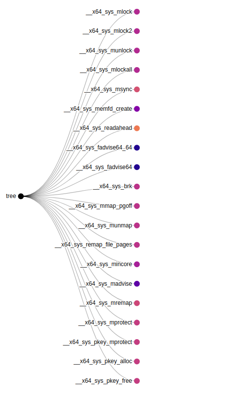
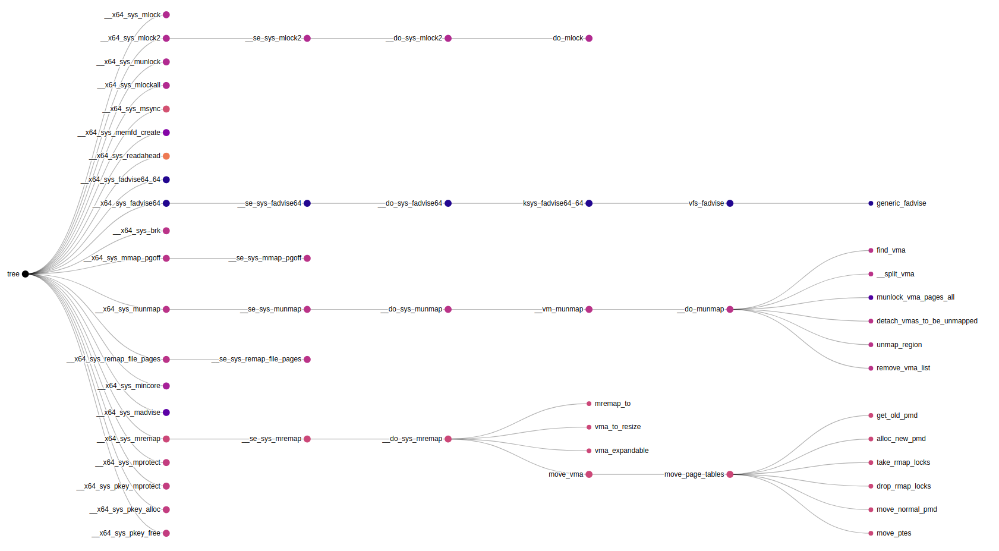

<!--
SPDX-FileCopyrightText: 2020 Bayerische Motoren Werke Aktiengesellschaft (BMW AG)

SPDX-License-Identifier: Apache-2.0
-->

# Create graphical kernel maps

Kernel map is an attempt to display graphical information in form of the call trees in the Linux kernel code. The map is created based on the calls information generated by callgraph-tool. Recommended
is the usage of calls.csv database generated by the clang-indexer backend.

```
clang-indexer.py --compdb ~/linux-stable/compile_commands.json --isystem none
```

The calls database contains all detected caller-callee pairs from the specified kernel build. In order to select specific subset of calls we can use configuration file in json format:

```json
{
    "caller":
    {
        "function": 
        {
            "exclude":
            {
                "contains": ["builtin", "trace_", "kasan_",
                             "test_", "printk", "strncmp",
                             "compiletime_assert"]
            }
        },
        "filename":
        {
            "include":
            {
                "contains": ["mm/"]
            }
        }
    },
    "callee":
    {
        "function": 
        {
            "exclude" :
            {
                "contains": ["builtin", "trace_", "kasan_",
                             "test_", "printk", "strncmp",
                             "compiletime_assert"]
            }
        },
        "filename":
        {
            "include":
            {
                "contains": ["mm/"]
            }
        }
    }
}
```
Configuration format is pretty intuitive. It represents dictionary with two main keys: "caller" and "callee". For each of those keys user can configure filters for columns "key\_function" and "key\_filename", respectively. Those filters allow user to exclude or keep (include) only specific functions and files in call database. For exclude and include filters one can select specific substrings using filter functions:
* contains - filename or path must contain specified substrings to match the filter 
* startswith - filename or path must start with specified substrings in order to match the filter
* endswith - filename or path must end with specified substrings in order to match the filter

Based on these filter, boolean index is created. We keep rows matching the include filter and drop
rows matching the exclude filter.

The reduced caller-callee list is then used to constract call graph (networkx.DiGraph). This graph
is further reduced by keeping only weakly connected components which contain syscall function.

Remaining nodes are then used to create final hierarchy. Detected syscalls are used as sources. Starting from this sources program builds subtrees of reachable nodes. They are assigned color information based on the call site file. Final result is stored in JSON file. 

As a final step, script runs localhost server which servers index.html file. This html file uses
JavaScript to load exported JSON file and d3.js library to display hierarchical data. In order to
view the resulting map type localhost:8080 (default port) in the browser search bar.


Initially, collapsed source nodes are displayed. 



Each node can be further expanded with the click on the node circle (in case they have children nodes).
 


# Usage
```
usage: kernel_map.py [-h] [--db DB] [--config CONFIG] [--name NAME]
                     [--depth DEPTH] [--port PORT]

Create JSON representation of the Linux subtree suitable for graphical
representation

optional arguments:
  -h, --help       show this help message and exit
  --db DB          Path to calls.csv file generated with clang-indexer
  --config CONFIG  JSON file containing filtering options with specified
                   configuration
  --name NAME      Name of the hierarchy root, also used as the output file
                   name
  --depth DEPTH    Maximum allowed hierarchy depth
  --port PORT      Run local server with specified port
```

# Possible extensions
- add generic matching filter for configuration file (e.g. regex)
- use different source nodes for building map
- add custom colormap
- show path information using legend or hover information


