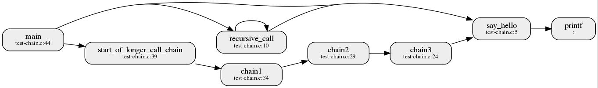
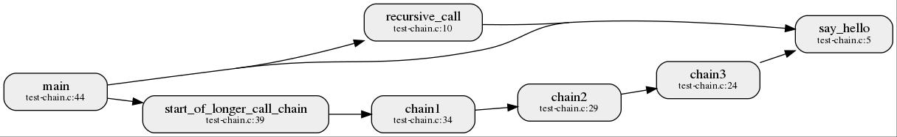
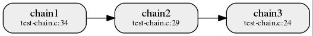
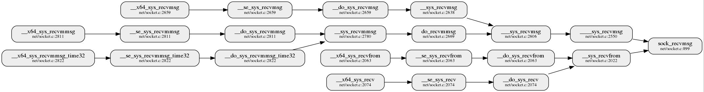

# Instructions for finding call chains in the graph

This page documents instructions and examples on usage of `find_callchains.py` script. The scripts offers a simple way to query all the call chains between one specific function and a set of a functions defined with the regular expression.

```
./find_callchains.py --help
usage: find_callchains.py [-h] --calls CALLS --from_function FROM_FUNCTION
                          --to_function TO_FUNCTION [--out OUT]
                          [--direction {left,right,both}] [-v]

Find function call chains reachable from the input function. The end of call
chain is defined with second argument which is a regular expression matching
one or more function names. The output is either the database of detected call
chains in csv format or image of the detected subgraph

optional arguments:
  -h, --help            show this help message and exit
  --out OUT             name of the output file containing detected chains
  --direction {left,right,both}
                        selects search direction.
  --cutoff CUTOFF       select cutoff length for path search
  -v, --verbose         set the verbosity level (e.g. -vv for debug level)

required named arguments:
  --calls CALLS         function call database csv file
  --from_function FROM_FUNCTION
                        function name from where the search begins (literal
                        match)
  --to_function TO_FUNCTION
                        function name where call chain ends (regex match)

Example: ./find_callchains.py --from_function sock_recvmsg --to_function
'^x64_sys'--calls calls.csv
```


The script exports the results of a user search either to a `CSV` file (if `out` input parameter ends with .csv) or to an image file otherwise. The source function is always a literal match, while the destination function can be defined as regular expression. The search can be performed in both directions, i.e. both in
callers of the source function - `left` search and callees of the source function - `right` search.

# Usage examples


Suppose that we have an example database for a program with a following call graph:


<br /><br />

## Search for callers

Say we are interested if the `say_hello` function is in callee list of `start_of_longer_call_chain` function. We can issue the following call to generate the path between those two functions if it exists:
```
./find_callchains.py --from_function say_hello --to_function start_of_longer_call_chain --direction left --out long_chain.jpg --calls calls.csv
```

The result of the query is in the following image:


<br /><br />

## Search for callees

We can also search in forward direction to find out the paths from a caller `main` to a specific function `say_hello` we are interested in:
```
./find_callchains.py --from_function main --to_function say_hello --direction right --out multi_chain.jpg --calls calls.csv
```
The command output is shown in:


<br /><br />

## Search for both callers and callees

If we want to find out if any of the `chainX` functions, where `X` is a single-digit number, is linked either as a caller or callee to `chain2` function we can issue the following query:
```
./find_callchains.py --from_function chain2 --to_function chain[0-9] --direction both --out chainX.jpg --calls calls.csv
```
This query results in a following image for a given database:


<br /><br />

## Larger example
The examples given so far are intentionally contrived to illustrate the capabilities of the script. These results could have easily been read out from the image of the whole program graph. The usefulness of the script can be demonstrated on a more complicated codebase, such as that of a Linux kernel. Say we want to find out the receive system calls that use `sock_recvmsg` function. We can answer this question by issuing the following query:
```
./find_callshains --calls calls.csv --from_function sock_recvmsg --to_function ^__x64_sys_recv --direction=left --cutoff=12 --out=from_sock_recvmsg_to_x64_sys_recv_left.jpg

```
Note that the database of kernel source is huge and analyzing the paths may take some time. In order to improve the performance, the optional `--cutoff` parameter can be used to limit the length of the paths that we are interested in.

The output is:

<br /><br />

# Resolving duplicate function names
If there are multiple functions in the input database that have the same name but are located in different files it is possible to specify the one that we are interested in using `filename:function` format. For example, if we have function `algo_implementation` in both `algo_slow.c` and `algo_fast.c` we can query the callers of the function using following query:
```
./find_callchains.py --calls=calls.csv --to_function=algo_caller_regex --from_function=algo_fast.c:algo_implementation --direction=left --out=say_hello.jpg 
```
