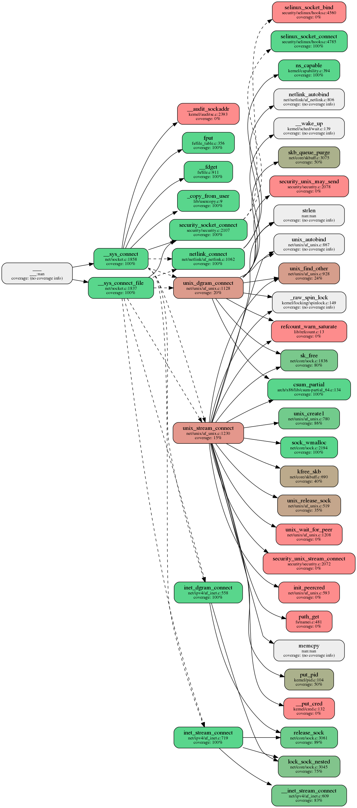

# Related functions detection

The script `find_related.py` is used to detect the related function in the call graph tree. There are two ways to use the script based on the `algorithm` argument value.
The first way of usage is to track the common system call ancestors of the two functions:

```
./find_related.py --calls=callgraph.csv --function1=inet_stream_connect --function2=unix_stream_connect --algorithm=ancestor --out=related.json
```
Where the arguments have the following meaning:
 * `calls` - callgraph database
 * `function1` - name of the first function for which we are looking common ancestor
 * `function2` - name of the second function for which we are looking common ancestor
 * `algorithm` - determines if we look an ancestor or an offspring
 * `out` - name of the output json file

The result is stored into a JSON file in the form of the entries containing filename, function and the definition line of the resulting functions:
```json
[
    {
        "function": "__sys_connect_file",
        "filename": "net/socket.c",
        "def_line": "1837.0"
    },
    {
        "function": "__sys_connect",
        "filename": "net/socket.c",
        "def_line": "1858.0"
    }
]
```
If there is more than one result in the output file this is a valuable input into determining potential other ways to increase the coverage of the code under analysis.

The second way of usage is to find the common subtree of the two (system) calls. In this concrete example we want to determine the common offsprings of the `sys_connect` and `_sys_connect_file` functions:
```
./find_related.py --calls=sys_connect.csv,sys_connect_file.csv --function1=__sys_connect --function2=__sys_connect_file "--algorithm=offspring --out=related.csv
```
Here, arguments have the following meaning:
 * `calls` - list of callgraph databases containing subtrees of function1 and function2, respectively
 * `function1` - name of the first function for which we are looking common offsprings
 * `function2` - name of the second function for which we are looking common offsprings
 * `algorithm` - determines if we look an ancestor or an offspring
 * `out` - name of the output CSV file

In this case the scripts also inserts additional dummy input with value `___` (tripple underscore) as a caller to a `function1` and `function2`. This represents a root to a new subtree generated by merging the common offsprings of these two functions. We can utilise the scripy `query_callgraph.py` in order to visualize the results:
```
./query_callgraph.py --csv=related.csv --depth=3 --function=___ --coverage_file=file.cov --out=related.png
```
The result of this query is displayed bellow 


